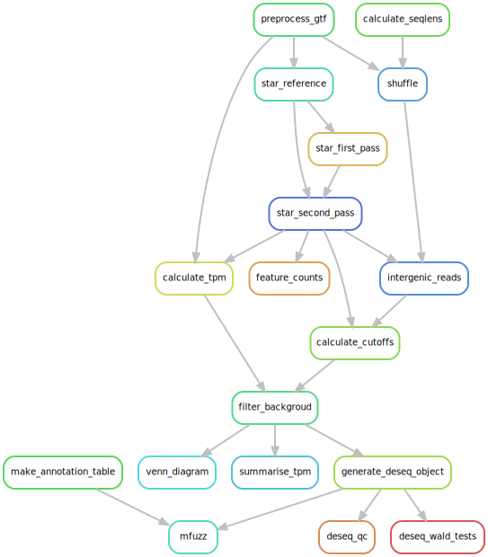

## pollen_dev

Analysis of pollen developmental series for Chakkatu *et al*., 2018.

### Requirements

[`singularity`](https://singularity.lbl.gov) ≥ 2.5.1   
[`snakemake`](https://snakemake.readthedocs.io) ≥ 5.2.1

### Reproduce the analysis

`snakemake --use-singularity --cores={threads}`

### Software environment

All steps are run using containers hosted on [Singularity Hub](https://singularity-hub.org/collections/996). The `--use-singularity` flag tells `snakemake` to pull the containers and run the analysis with the software installed in the container.

### Workflow

### Input data files

The following files are not distributed with the workflow, and must be in a `data` directory under the current working directory.

- Raw reads:
    + Will be added to SRA on publication
- TAIR 10 assembly:
    + TAIR10_Chr.all.fasta from [https://www.arabidopsis.org/download_files/Genes/TAIR10_genome_release/TAIR10_chromosome_files/TAIR10_chr_all.fasta](https://www.arabidopsis.org/download_files/Genes/TAIR10_genome_release/TAIR10_chromosome_files/TAIR10_chr_all.fas)
- Araport 11 annotation:
    + `Araport11_GFF3_genes_transposons.201606.gff` from [https://www.araport.org/downloads/Araport11_Release_201606/annotation](https://www.araport.org/downloads/Araport11_Release_201606/annotation)
- Supplementary file `gb-2004-5-11-r85-s1.xls` from Honys and Twell, 2004 ([10.1186/gb-2004-5-11-r85](https://doi.org/10.1186/gb-2004-5-11-r85))
- Supplementary file `data sheet 1.xls` from Li *et al*., 2017 ([10.3389/fpls.2017.01559](https://doi.org/10.3389/fpls.2017.01559))
